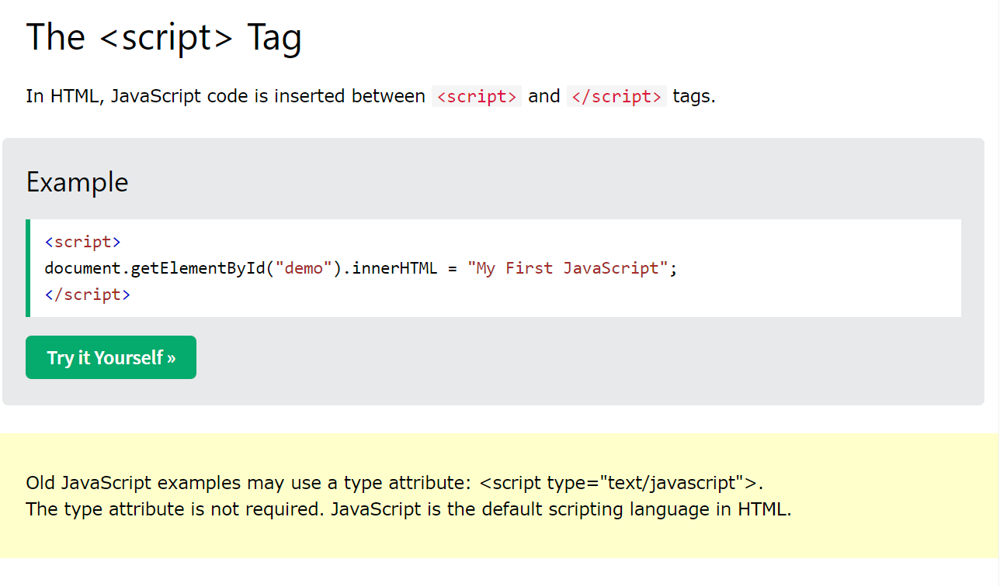
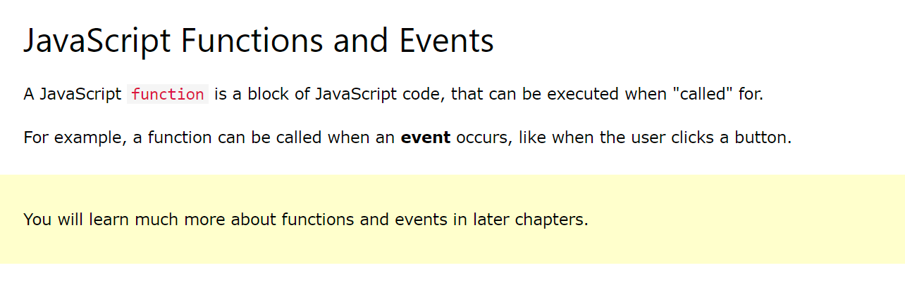
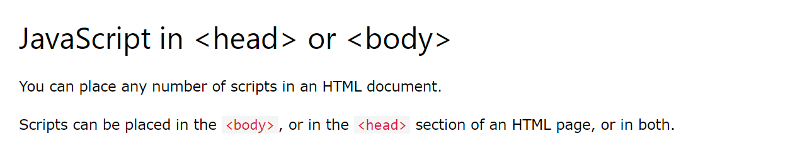
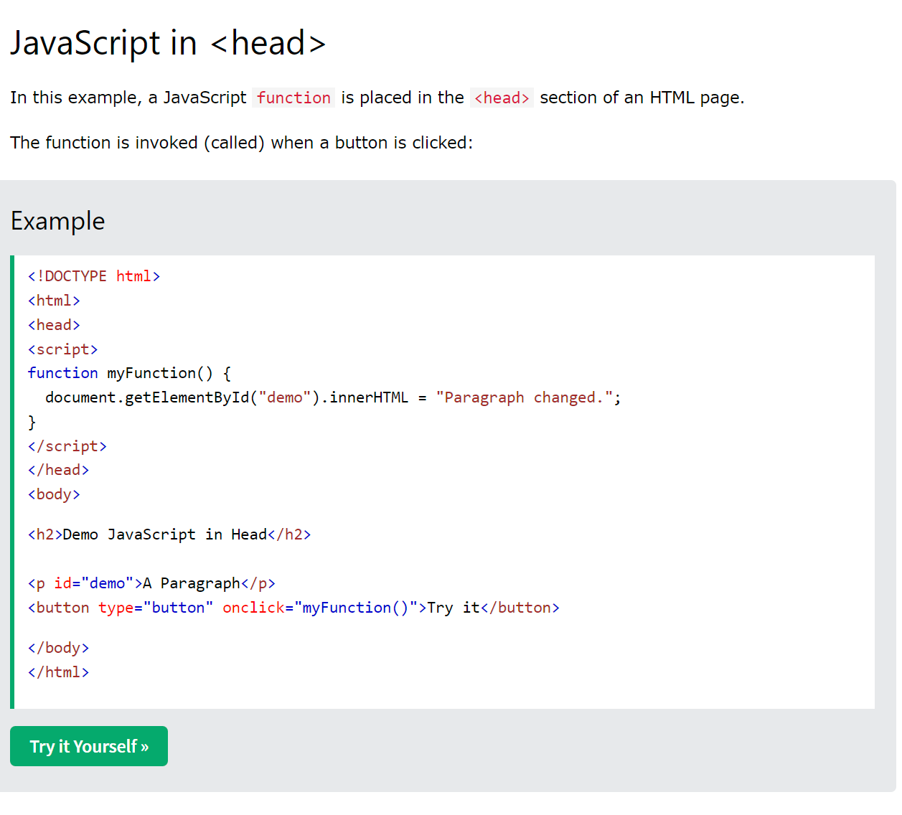
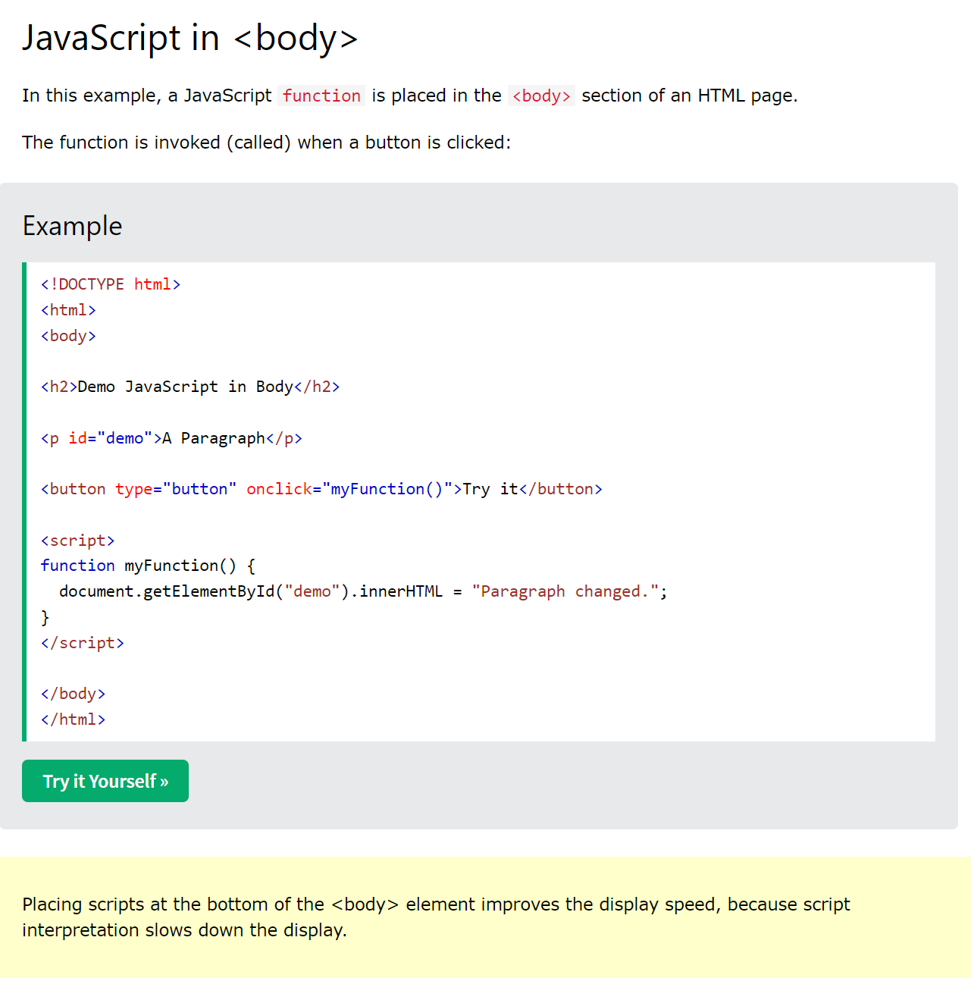
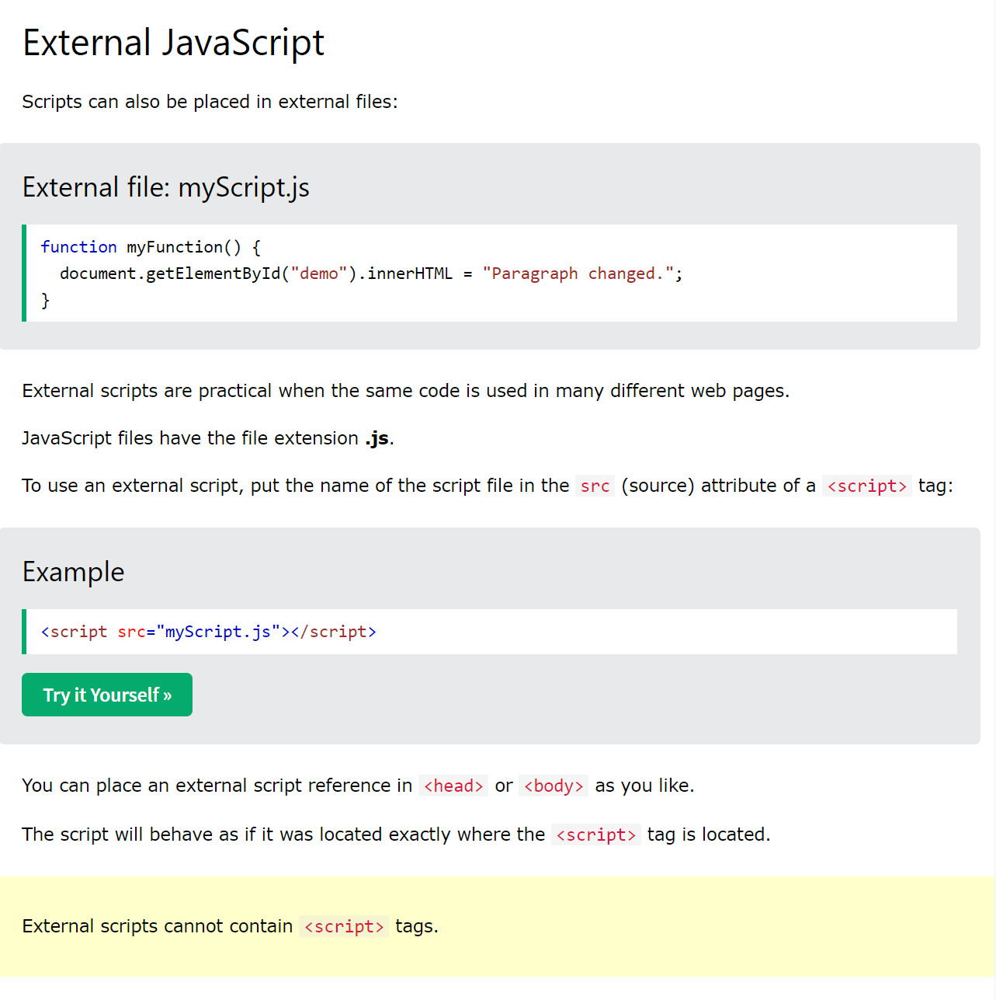
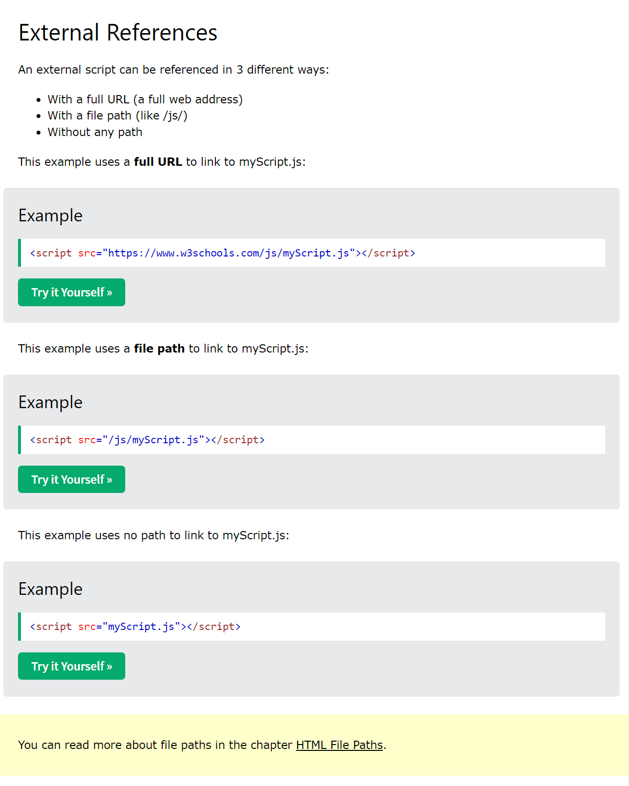
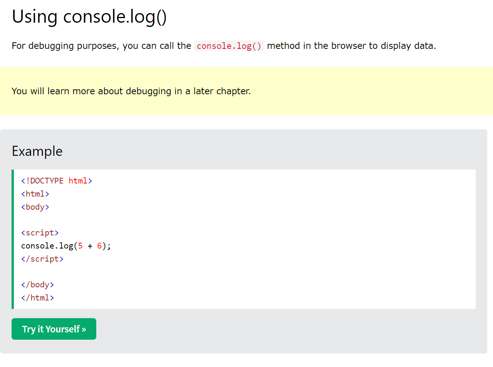

[Example](https://www.w3schools.com/js/tryit.asp?filename=tryjs_whereto)

[Example](https://www.w3schools.com/js/tryit.asp?filename=tryjs_whereto_head)
\
[Example](https://www.w3schools.com/js/tryit.asp?filename=tryjs_whereto_body)

[Example](https://www.w3schools.com/js/tryit.asp?filename=tryjs_whereto_external)

[Example](https://www.w3schools.com/js/tryit.asp?filename=tryjs_whereto_url)
[Example](https://www.w3schools.com/js/tryit.asp=filename=tryjs_whereto_url_relative)
[Example](https://www.w3schools.com/js/tryit.asp?filename=tryjs_whereto_external)

[Example](https://www.w3schools.com/js/tryit.asp?filename=tryjs_output_console)
